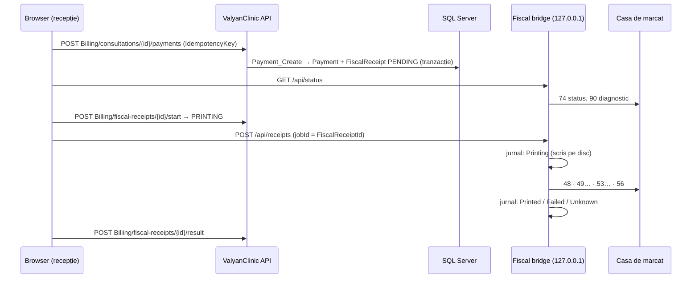
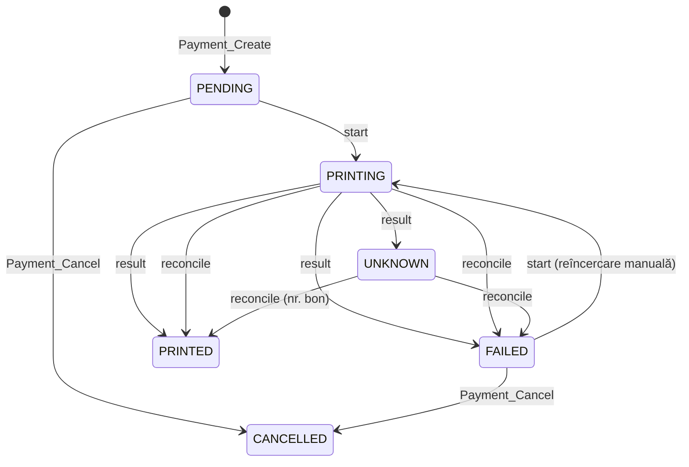

# Ghid developer — Modulul financiar

## 1. Arhitectură

- BE: Clean Architecture + MediatR + Dapper/SP. Regulile de business sunt în SP-uri (`THROW 506xx`), handler-ele mapează la `Result<T>`.
- Bridge: proiect separat `src/ValyanClinic.FiscalBridge` (ASP.NET Core minimal API + Windows Service). Nu referă aplicația — contractul e HTTP.
- FE: `features/billing` (încasări, bon), `features/invoices`, `features/tariffs`, `features/settings` (setări financiare), tab-ul `features/consultations/services`.

## 2. Baza de date

| Migrare | Conținut |
|---|---|
| 0052 | Status consultație `FACTURATA` (C2…0004), `Consultations.RowVersion` |
| 0053 | `VatRates`, `ServiceCategories`, `MedicalServices` (RowVersion), `MedicalServicePrices` [ValidFrom, ValidTo), modul `tariffs`, `Clinics.IsVatPayer` |
| 0054 | `ConsultationServices` (snapshot preț, `LineTotal` calculat persistent) |
| 0055 | `PaymentMethods`, `Payments` (IdempotencyKey unic), `PaymentTenders`, `InvoiceStatuses`, `InvoiceSeries`, `Invoices` (snapshot furnizor/client), `InvoiceLines`, TVP-uri |
| 0056 | `FiscalReceiptStatuses`, `FiscalReceipts` (unic pe PaymentId), linii, plăți, evenimente, `FiscalSettings`, mapări TVA / plăți |

Rollback manual: `Scripts/Rollback/005x_Rollback_*.sql` (nu sunt rulate de DbUp).

Reguli cheie în SP-uri:
- `ConsultationService_*`: doar pe `INLUCRU` / `FINALIZATA` (UPDLOCK pe consultație) → altfel 50601.
- `Payment_Create`: idempotent pe cheie; numerar/card = toată suma, fără plăți anterioare (50633); transferul nu se combină (50635); mapări obligatorii (50642); consultația → `FACTURATA`.
- `Payment_Cancel`: interzis dacă bonul e `PRINTED` (50634) sau `UNKNOWN`/`PRINTING` (50644).
- `Invoice_Create`: idempotent; numerotare fără goluri (UPDLOCK pe serie); linii personalizate doar după storno (50622); CNP citit server-side doar la cerere.
- `Invoice_Storno`: aceeași serie, linii negative, original → `STORNATA`.
- `FiscalReceipt_*`: tranziții validate (vezi mai jos).

## 3. Mașina de stări a bonului

Garanții:
1. **Un bon per plată** — `FiscalReceipts.PaymentId` unic; plata e idempotentă.
2. **Fără retipărire oarbă** — UNKNOWN nu are tranziție spre PRINTING; bridge-ul refuză să retrimită un job aflat în jurnal ca `Printing`/`Unknown`.
3. **Starea aparatului înaintea oricărei comenzi fiscale** — bridge-ul citește statusul (hârtie, capac, bon deschis) înainte de a scrie `Printing`.
4. **Clasificare precisă** în `DatecsFiscalPrinter`: orice eșec **înainte** de comanda de închidere → anulare bon deschis (60) → `Failed`; fără confirmare **după** închidere → `Unknown`.
5. FE verifică bridge-ul **înainte** de `start` → un bridge oprit nu lasă bonuri „În tipărire".

## 4. Protocol Datecs (clasic, DP-25)

`Printing/Datecs/*`. Toate comenzile sunt marcate `// NEVERIFICAT PE APARAT`.

| Element | Implementare |
|---|---|
| Cadru cerere | `01 LEN SEQ CMD DATA 05 BCC(4) 03`, LEN = octeți după 01 până la 05 + 20h |
| Cadru răspuns | `01 LEN SEQ CMD DATA 04 STATUS(6) 05 BCC(4) 03` |
| BCC | suma octeților LEN…05, 4 nibble-uri + 30h |
| SEQ | 20h–7Fh, circular; răspunsurile cu altă secvență se ignoră |
| SYN (16h) | aparatul lucrează — se așteaptă până la `BusyTimeoutMs` |
| NAK (15h) / BCC greșit | retransmitere cu **aceeași** secvență (max `MaxNakRetries`) |
| Tăcere | `DatecsCommunicationException` → rezultat necunoscut |
| Status cu eroare | `DatecsDeviceException` → comanda sigur neexecutată |

| Cmd | Folosire | Date trimise |
|---|---|---|
| 48 (30h) | deschidere bon | `<OpCode>,<OpPwd>,<TillNmb>` |
| 49 (31h) | vânzare | `<Denumire>\t<GrupaTVA><Preț>*<Cant>` |
| 53 (35h) | plată | `\t<CodPlată><Sumă>` → `D…` = achitat |
| 56 (38h) | închidere | → `<AllReceipt>,<FiscReceipt>` |
| 60 (3Ch) | anulare bon deschis | — |
| 74 (4Ah) | status | — |
| 90 (5Ah) | diagnostic (nr. serie în câmpul 5) | — |

Modelele „X" (DP-25X, FP-700X…) folosesc alt format (LEN/CMD pe 4 octeți, parametri separați prin tab, status pe 8 octeți) — ar necesita un `IFiscalPrinter` separat.

**FiscalNet** (alternativa b): driver al furnizorului bazat pe fișiere de comenzi. Mai rapid de integrat, dar cu licență per stație, încă un proces de monitorizat și status mai opac (răspuns asincron prin fișier) — de aceea s-a ales protocolul direct, cu transport abstractizat (`IDatecsTransport`: serial / TCP). Un `FiscalNetFiscalPrinter : IFiscalPrinter` se poate adăuga fără schimbări în restul bridge-ului.

## 5. Securitatea bridge-ului

- Kestrel doar pe `IPAddress.Loopback`.
- Token 256 biți, generat la primul start, salvat cu DPAPI (LocalMachine + entropie); comparație în timp constant (`BridgeTokenFilter`).
- CORS doar pentru `Bridge:AllowedOrigins`; suport pentru Private Network Access (preflight).
- FE apelează bridge-ul cu `fetch`, **nu** cu instanța axios — JWT-ul aplicației nu ajunge la bridge.
- Parola operatorului: DPAPI, citită de la tastatură (`--set-operator-password`), mascată în jurnal.

## 6. Teste

| Proiect | Acoperire |
|---|---|
| `tests/ValyanClinic.Tests` | BillingCalculator (100 + 50 = 150, rotunjiri), handler-e tarife / servicii / plăți / facturi / bonuri, validatori, PDF |
| `tests/ValyanClinic.IntegrationTests` → `BillingFlowTests` | Pe BD reală, în TransactionScope: snapshot preț la schimbarea tarifului, blocare după facturare, idempotență plată și factură, numerotare continuă, storno |
| `tests/ValyanClinic.FiscalBridge.Tests` | Cadre / BCC / status Datecs, SYN / NAK / tăcere, clasificarea rezultatului pe un aparat simulat, mașina de stări cu MockFiscalPrinter (hârtie, capac, offline, necunoscut, crash, conflict), jurnal persistent, token |
| `client/src/__tests__/features/{tariffs,billing}` | Scheme Zod (reguli plată, factură, reconciliere), orchestrarea tipăririi (`printFiscalReceipt`) |
| `client/e2e/specs/billing.spec.ts` | Paginile financiare, fără efecte asupra datelor |

Integration tests: rulați **doar** `--filter "FullyQualifiedName~BillingFlowTests"` pe BD de dezvoltare (celelalte pot reseta BD).

Bridge local cu simulare: `dotnet run --project src/ValyanClinic.FiscalBridge` (`Printer:Driver = Mock`; scenarii: `Printer:MockScenario = PaperOut | CoverOpen | Offline | DeviceErrorOnSale | TimeoutAfterClose`).

## 7. Limitări cunoscute

- `Consultations.RowVersion` există, dar `Consultation_Update` nu îl verifică încă (autosave-ul pe tab-uri ar genera conflicte false) — protecția e prin status (doar `INLUCRU` e editabil).
- e-Factura: modelul de date e pregătit (coduri UBL, snapshot furnizor/client, TypeCode 380), fără generare XML și fără transmitere SPV.
- Rapoartele X / Z nu sunt implementate (în afara scopului).
