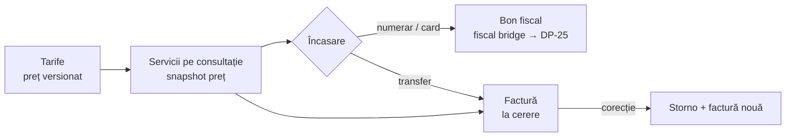

# Modulul financiar — Documentație

Tarife, servicii pe consultație, încasări, bon fiscal (Datecs DP-25), facturi și stornări.

| Pentru | Fișier | Conținut |
|---|---|---|
| Recepție / medic | [README.USER.md](./README.USER.md) | Servicii pe consultație, încasare, bon, factură, reconciliere |
| Administrator / manager | [README.ADMIN.md](./README.ADMIN.md) | Tarife, TVA, serii, casa de marcat, instalare fiscal bridge, permisiuni |
| Developer | [README.DEVELOPER.md](./README.DEVELOPER.md) | Arhitectură, mașina de stări a bonului, protocol Datecs, teste |
| API | [API-ENDPOINTS.md](./API-ENDPOINTS.md) | Endpoint-urile ValyanClinic + API-ul local al bridge-ului |
| Întrebări | [FAQ.md](./FAQ.md) | Întrebări frecvente |
| Probleme | [TROUBLESHOOTING.md](./TROUBLESHOOTING.md) | Simptom → cauză → soluție |
| Istoric | [CHANGELOG.md](./CHANGELOG.md) | Modificări |

## Pe scurt

- **Prețul** unui serviciu se ia din tariful în vigoare **în momentul adăugării** pe consultație și nu se mai schimbă.
- **Totalul** consultației = suma liniilor (ex: 100 + 50 = 150 RON).
- După primul document fiscal (bon sau factură) consultația devine **Facturată**: serviciile și fișa clinică devin doar citire.
- Corecțiile se fac **doar prin stornare** — nimic nu se șterge.
- Un bon fiscal se emite **o singură dată** per plată. Dacă nu se știe dacă a ieșit, se face **reconciliere manuală**, niciodată retipărire automată.

## Ecrane

| Rută | Ecran | Modul permisiuni |
|---|---|---|
| `/consultations` → tab „Servicii" | Serviciile efectuate, din fișa consultației | consultations |
| `/billing` | Încasări (recepție) | payments |
| `/invoices` | Facturi | invoices |
| `/tariffs` | Nomenclator tarife | tariffs |
| `/settings/financial` | Setări financiare | invoices + payments |
