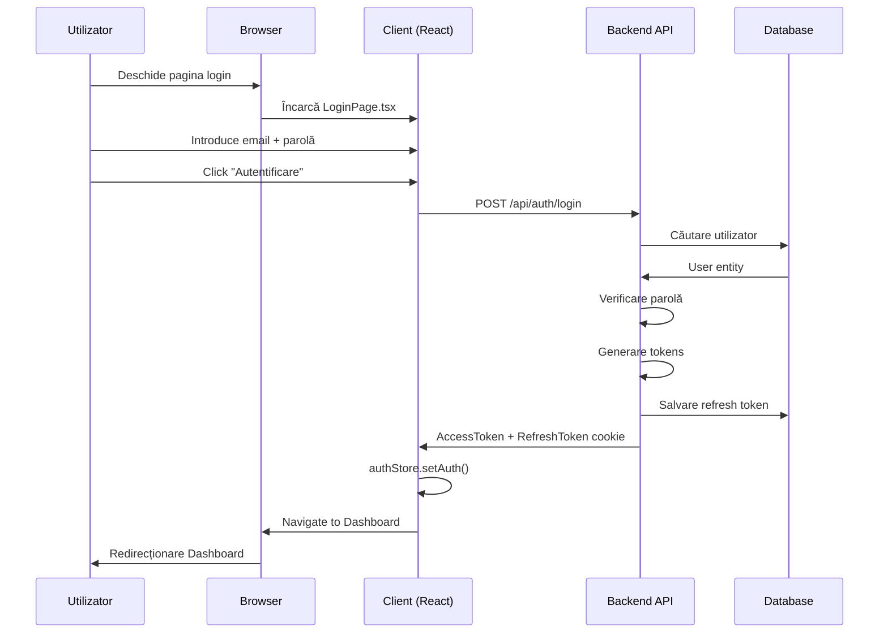

# 📚 Documentația Paginii de Login - ValyanClinic

## 📖 Ghiduri disponibile

Această pagină de login este documentată pentru **trei tipuri de utilizatori**:

### 👤 [README.USER.md](README.USER.md) - **Ghid Utilizator**
*Pentru pacienți, doctori, asistente și recepționiste*

Cuprinde:
- 🔐 Cum să te autentifici
- ⚠️ Troubleshootare probleme comune
- 🔒 Sfaturi de securitate
- 📲 Schimbarea parolei
- 🆘 Contact support

**Timp de citire:** ~5-10 min

---

### 🛡️ [README.ADMIN.md](README.ADMIN.md) - **Ghid Administrator**
*Pentru administratori de sistem și manageri IT*

Cuprinde:
- 🔧 Configurare parametri securitate
- 👤 Gestionare conturi utilizatori
- 🔍 Monitorizare și audit logs
- 🔴 Alertări și notificări
- 📋 Checklist configurare sigură
- 🆘 Troubleshooting admin

**Timp de citire:** ~15-25 min

---

### 👨‍💻 [README.DEVELOPER.md](README.DEVELOPER.md) - **Ghid Developer**
*Pentru ingineri software și arhitecți*

Cuprinde:
- 📁 Structura fișierelor
- 🔧 Tech stack (React, TypeScript, C#, etc.)
- 📊 Flow autentificare
- 💡 Implementare frontend (React hooks, Zod, Zustand)
- 🔐 Implementare backend (CQRS, MediatR, JWT)
- 🧪 Testing (unit + integration)
- 🚀 Features și extensii viitoare
- 🐛 Debugging techniques

**Timp de citire:** ~30-45 min

---

## 🎯 Quick Start

**Sunt utilizator și nu pot să mă conectez?**  
→ Deschide [README.USER.md](README.USER.md#%EF%B8%8F-probleme-și-soluții)

**Sunt administrator și trebuie să configurez login?**  
→ Deschide [README.ADMIN.md](README.ADMIN.md#-configurare-și-management)

**Sunt developer și trebuie să modific codul de autentificare?**  
→ Deschide [README.DEVELOPER.md](README.DEVELOPER.md)

---

## 📊 Informații generale despre Login

| Aspect | Detalii |
|--------|---------|
| **URL** | `https://valyan-clinic.local/login` |
| **Roluri suportate** | Admin, Doctor, Nurse, Receptionist, Clinic Manager |
| **Protocol** | OAuth 2.0 + JWT (RS256/HS256) |
| **Token access** | 8 ore (configurable) |
| **Token refresh** | 7 zile (HttpOnly cookie) |
| **Rate limiting** | 5 încercări/15min per IP |
| **Account lockout** | 15 min după 3 tentative greșite |
| **Criptare** | HTTPS obligatoriu, Parolă: BCrypt/Argon2 |
| **Compliance** | GDPR, CNAS, SIUI |

---

## 🔒 Securitate

✅ **Implementat:**
- Token-uri JWT securizate
- Hashing parolă cu BCrypt
- Rate limiting pe API
- Account lockout protecție
- HttpOnly cookies
- CORS validation
- Input validation (Zod)

> ⚠️ **Important:** Suportul pentru 2FA (Two-Factor Auth) este planificat pentru versiuni viitoare.

---

## 📂 Structura directoarelor

```
src/ValyanClinic.Shared/Documentation/
└── Pages/
    └── Login/
        ├── README.md                 ← Index (acest fișier)
        ├── README.USER.md            ← Ghid utilizator
        ├── README.ADMIN.md           ← Ghid administrator
        ├── README.DEVELOPER.md       ← Ghid developer
        ├── CHANGELOG.md              ← Versiuni și actualizări
        ├── API-ENDPOINTS.md          ← Referință API
        ├── FAQ.md                    ← Întrebări frecvente
        └── TROUBLESHOOTING.md        ← Soluție probleme
```

---

## 🔄 Procese și workflows

### Flux autentificare - Imagine de ansamblu



### Flux refresh token

```mermaid
sequenceDiagram
    participant C as Client
    participant API as Backend
    participant DB as Database

    Note: AccessToken expirat (8h)
    C->>API: POST /api/auth/refresh
    API->>API: Validare RefreshToken
    API->>DB: Verificare stored token
    DB->>API: Token valid
    API->>API: Generare token nou
    API->>C: New AccessToken
    C->>C: authStore.updateToken()
    Note: Utilizator rămâne conectat

```

---

## 🔧 Configurare (DevOps)

### Environment variables

```bash
# JWT
JWT_SECRET=your-secret-key
JWT_ISSUER=https://valyan-clinic.local
JWT_AUDIENCE=valyan-clinic-spa

# Token Expiration
ACCESS_TOKEN_EXPIRY_MINUTES=480  # 8 ore
REFRESH_TOKEN_EXPIRY_DAYS=7

# Rate Limiting
RATE_LIMIT_MAX_ATTEMPTS=5
RATE_LIMIT_WINDOW_MINUTES=15
RATE_LIMIT_LOCKOUT_MINUTES=30

# Database
DATABASE_CONNECTION_STRING=...

# CORS
CORS_ALLOWED_ORIGINS=https://valyan-clinic.local
```

### appsettings.json (Backend)

```json
{
  "JwtOptions": {
    "Secret": "{JWT_SECRET}",
    "Issuer": "{JWT_ISSUER}",
    "Audience": "{JWT_AUDIENCE}",
    "AccessTokenExpiryMinutes": 480,
    "RefreshTokenExpiryDays": 7
  },
  "RateLimiting": {
    "Enabled": true,
    "MaxAttempts": 5,
    "WindowMinutes": 15,
    "LockoutMinutes": 30
  }
}
```

---

## 📈 Statistici și monitoring

### KPIs de monitorizat

- 📊 Rata login success vs failed
- ⏱️ Timp mediu de autentificare
- 🔒 Conturi blocate (daily)
- 🌍 Logări pe IP (pentru detecție anomalii)
- 🕐 Peak login hours
- 📱 Distribuție client-uri (browser, app)

### Dashboard monitoring

```
Admin Panel > Security > Authentication Metrics
```

---

## 🐛 Probleme cunoscute și limitations

**Version 1.0:**
- ⚠️ Doar email + parolă (fără 2FA)
- ⚠️ Nu suportă SSO (viitor)
- ⚠️ Nu are Magic Links (planificat)
- ⚠️ Device management manual (viitor)

---

## 🚀 Roadmap viitor

**v1.1 (Q2 2025):**
- ☐ 2-Factor Authentication (2FA)
- ☐ Email verification îmbunătățit
- ☐ Session timeout warning

**v1.2 (Q3 2025):**
- ☐ Azure AD integration
- ☐ SAML 2.0 support
- ☐ Device fingerprinting

**v2.0 (Q4 2025):**
- ☐ Passwordless login (WebAuthn)
- ☐ Biometric auth
- ☐ Risk-based authentication

---

## 📞 Suport și contact

### Pentru utilizatori
📧 **support@valyan-clinic.ro**  
📞 +40 (XXX) XXX-XXXX  
⏰ Luni-Vineri 09:00-17:00

### Pentru administratori
📧 **admin-support@valyan-clinic.local**  
📞 +40 (XXX) XXX-XXXX  
⏰ 24/7 on-call

### Pentru developeri
📧 **tech-team@valyan-clinic.local**  
🐙 GitHub Issues: `/ValyanClinic/issues`  
📚 Docs: `/docs/authentication`

---

## 📄 License și compliance

- ✓ GDPR compliant
- ✓ CNAS integration ready
- ✓ SIUI compatible
- ✓ ISO 27001 (planned)

---

## 🔄 Versioning

**Versiunea curentă:** 1.0.0  
**Released:** 2025-03-08  
**Next patch:** 2025-03-22

[Logul complet de versiuni →](CHANGELOG.md)

---

## 📚 Documente conexe

- [API Reference (endpoints)](API-ENDPOINTS.md)
- [FAQ - Întrebări frecvente](FAQ.md)
- [Troubleshooting Guide](TROUBLESHOOTING.md)
- [Changelog](CHANGELOG.md)

---

**© 2025 ValyanClinic. Toate drepturile rezervate.**  
**Documentație internă - Confidențial**
